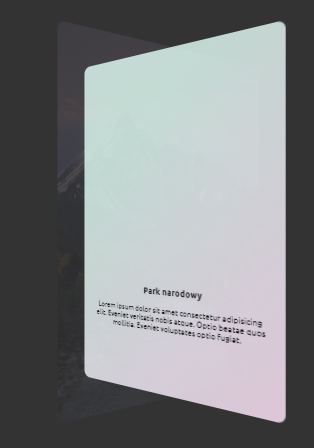
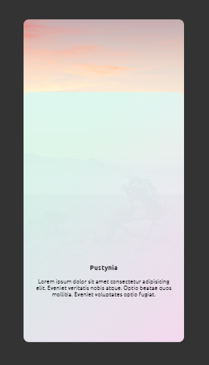

# 3D Card Hover Effects

This project showcases a set of 3D card hover effects using HTML and CSS. Each card reveals a stunning background image on hover, along with a captivating gradient overlay and text content.

## Preview

## Features

- 3D rotation on hover for an engaging visual effect.
- Smooth transitions and animations for a polished user experience.

## Technologies Used

- HTML
- CSS
- VS Code

Feel free to provide any feedback or suggestions on how to improve this project! 🚀✨